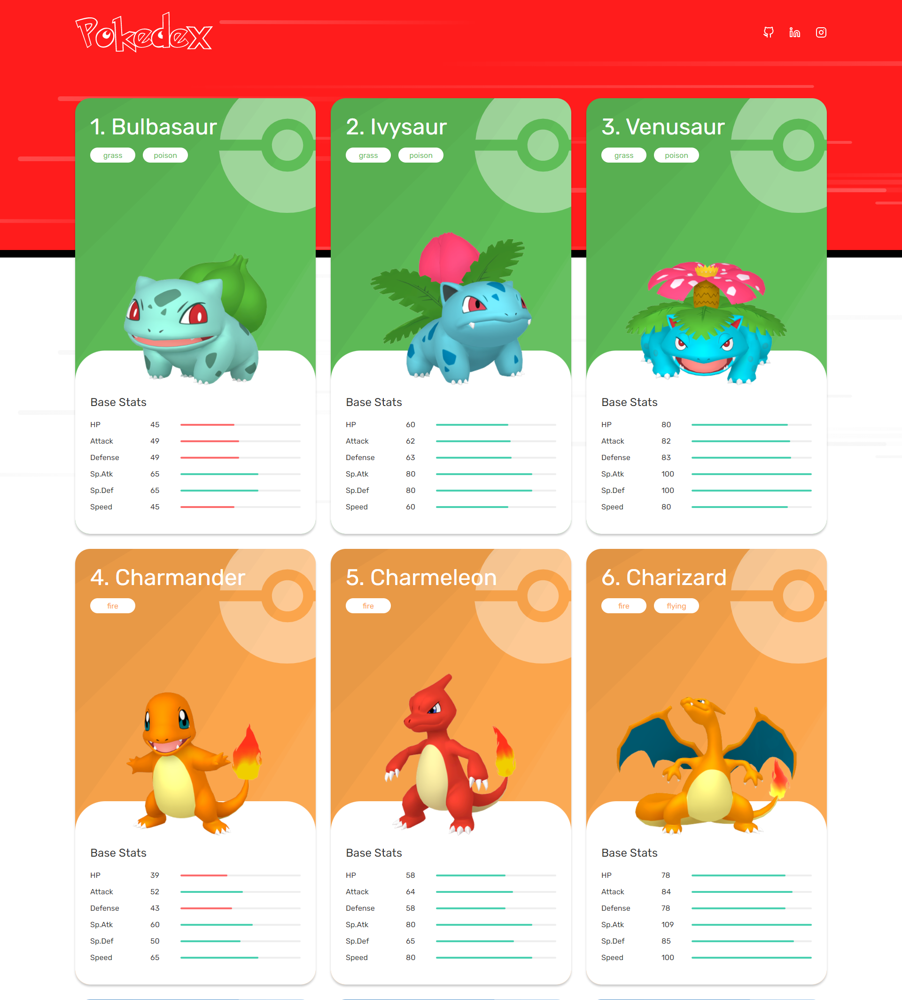

# Pokédex

Aplicação web simples que consulta a **PokéAPI** e exibe informações básicas de Pokémon (nome, imagem/sprite, tipos) usando **HTML5**, **CSS3/SCSS** e **JavaScript** puro — sem frameworks. Demo em produção: **[https://pokedex-carlosdancr.vercel.app/](https://pokedex-sable-eta-87.vercel.app/)**.



## 🚀 Demo

- **Produção:** [https://pokedex-carlosdancr.vercel.app/](https://pokedex-sable-eta-87.vercel.app/)

## 🧰 Tecnologias

- **HTML5**
- **CSS3 / SCSS**
- **JavaScript (ES6+)**
- **PokéAPI (REST)** — Base URL: `https://pokeapi.co/api/v2/`

> Observação: o repositório é majoritariamente **SCSS**, seguido de **JavaScript** e **HTML**.

## 📦 Estrutura do projeto

```
/
├── css/              # estilos (SCSS/CSS)
├── img/              # imagens/ativos
├── app.js            # lógica da aplicação (fetch da PokéAPI, interação da UI)
├── index.html        # documento principal
├── favicon.svg
└── README.md
```

A lista de arquivos/pastas acima corresponde ao conteúdo do repositório.

## 📚 Como funciona (alto nível)

1. A página carrega `index.html` e os estilos de `/css`.  
2. O script `app.js` realiza **requisições REST** para a **PokéAPI** (por exemplo, `GET /pokemon/{id}`) e preenche a interface com os dados retornados (nome, tipos e sprites disponíveis).

## 🖥️ Executando localmente

> Este é um **site estático**; não há necessidade de backend.

### Opção A: Abrir o arquivo
1. Clone ou baixe o repositório.
2. Abra `index.html` diretamente no navegador.

### Opção B: Servidor estático (recomendado)
Use qualquer servidor estático (por exemplo, a extensão **Live Server** do VS Code ou `npx serve`):

```bash
# com Node instalado
npx serve .
# ou use a extensão Live Server do VS Code e clique em "Open with Live Server"
```

## 🔗 Integração com a PokéAPI

- **Base**: `https://pokeapi.co/api/v2/`  
- **Exemplo de recurso**: `GET /pokemon/ditto` retorna JSON com nome, tipos, sprites, estatísticas etc.

## ✅ Status do projeto

Concluído.

## 🤝 Como contribuir

1. Faça um fork do repositório.
2. Crie um branch para sua feature/fix: `git checkout -b feat/minha-ideia`.
3. Commit: `git commit -m "feat: descreva sua mudança"`.
4. Push: `git push origin feat/minha-ideia`.
5. Abra um Pull Request.

Sugestões úteis:
- Manter o código simples e idiomático (JS/DOM).
- Preferir componentes e classes CSS semânticas.
- Atualizar este README quando incluir funcionalidades novas.

## 🧾 Licença

Nenhuma licença foi declarada no repositório no momento desta escrita. Se pretende reutilizar o código, considere abrir uma issue para alinhar permissões com o autor.

## 🙌 Créditos

- **Dados:** [PokéAPI](https://pokeapi.co/) — API pública e gratuita da comunidade.
- **Autor do projeto:** [@carlosdancr](https://github.com/carlosdancr)
